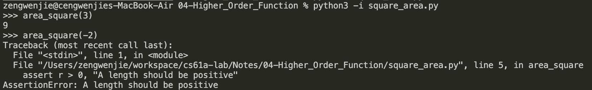
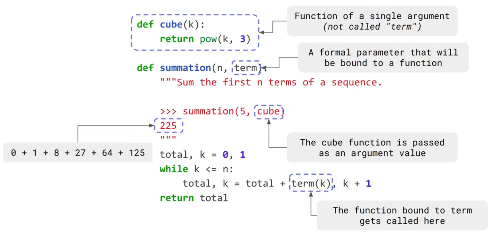
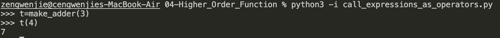
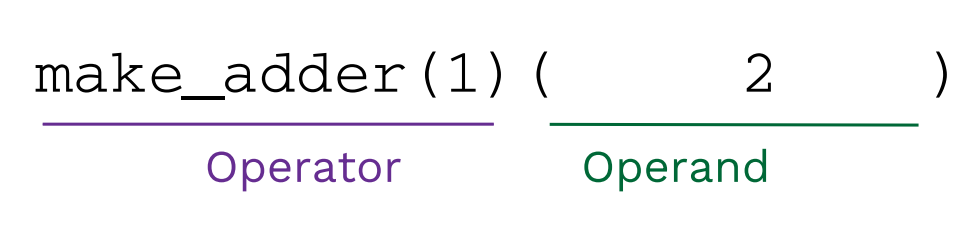
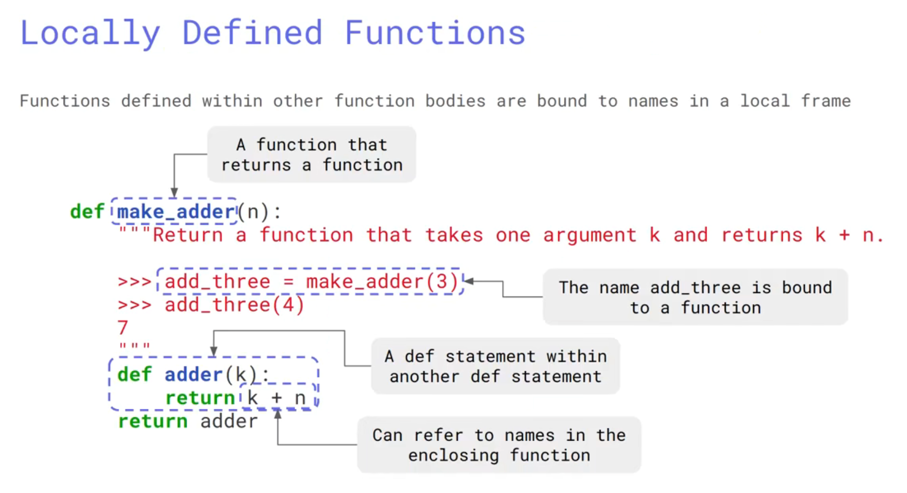
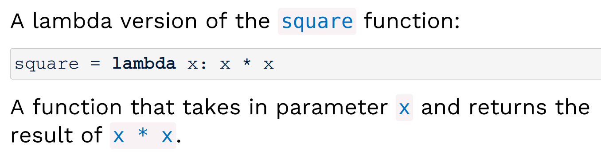
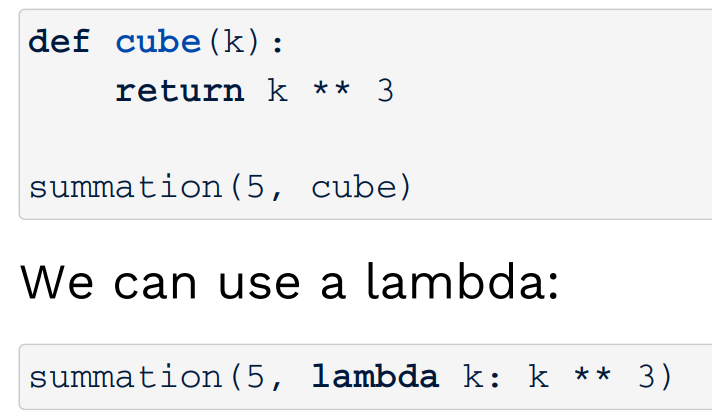
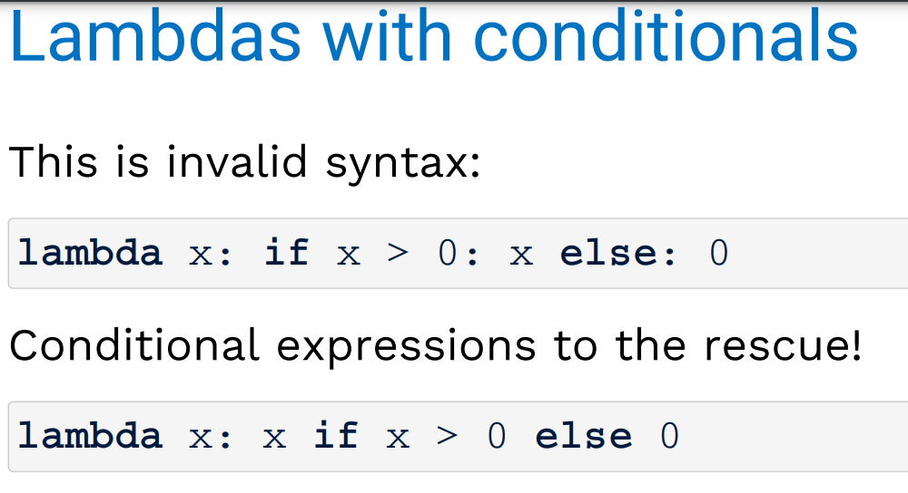

# Higher_Order_Functions
## Designing functions
a `higher-order function` is:<br>
1. a function that a function `as an argument`
2. a function that returns a function as a `return value`

- Describe functions
1. a function's `domain` is the set of all inputs it might possibly take as arguments
2. a function's `range` is the set of all output values it might possibly return.
3. a pure function's `behavior` is the relationship it creates between input and ouput

- round function `四舍五入`,second param is used to set the number of decimals


- area_square function `consider r<=0 circumstances using assert`
1. `assert r>0,"..."` means if `not r>0` will raise an AssertionError: `...`
2. 
```py
from math import pi, sqrt


def area_square(r):
    assert r > 0, "A length should be positive"
    return r * r


def area_circle(r):
    assert r > 0, "A length should be positive"
    return pi * r * r
```
3. 



## Higher-order functions
1. `Functions defined within other function bodies are bound to names in a local frame.`
```py
def make_adder(n):
    """return a function that takes one argument k"""
    """ and return k+n"""

    def adder(k):
        return k + n

    return adder
```

2. `call expressions as operator expressions:`<br>


3. `more complex one:`<br>
```py
def make_adder(n):
    """return a function that takes one argument k"""
    """ and return k+n"""

    def adder(k):
        return k + n

    return adder
square = lambda x: x * x
def compose1(f, g):
    def h(x):
        return f(g(x))

    return h
print(compose1(square, make_adder(2))(3))  # 25
```
4. `returning a function using its own name`
```py
def print_sums(n):
    print(n)

    def next_sum(k):
        return print_sums(n + k)

    return next_sum
print_sums(1)(3)(5)
"""
1->print_sums(4)(5)
4->print_sums(9)
9->print_sums
"""
```
## Lambda expressions
`A lambda expression` is a simple function definition that evaluates to a function
<br>
The syntax:

`lambda <parameters>: <expression>`: a function that takes in `parameters` and returns the result of `expression`
<br>



## Conditional expressions
`<consequent> if <predicate> else <alternative>`

```py
lambda x:x if x>0 else 0
```