## multiple environment
1. Assignment Statements
2. Def Statements
3. Call Expressions
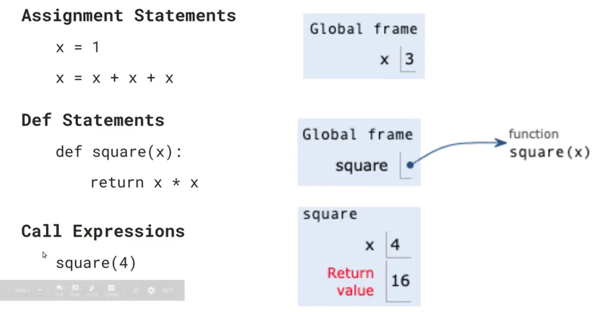
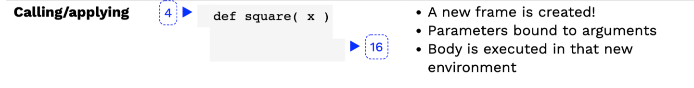
`a new frame will be created in the function`
### Terminology:Frames
1. frame `keeps track of variable-to-value bindings`
2. Global frames `the global frame,is the starting frame.`
3. Parent frames `The parent of a function is the frame in which it was defined`
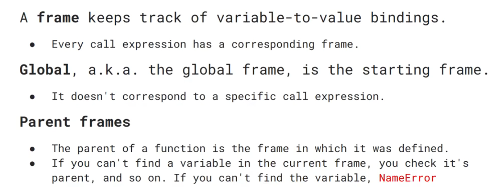 
### A nested call expression
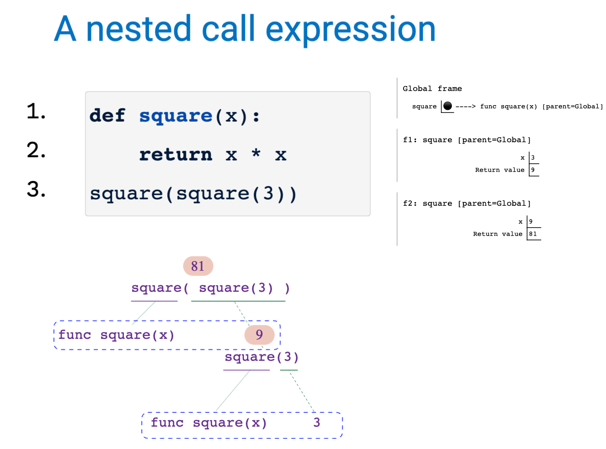
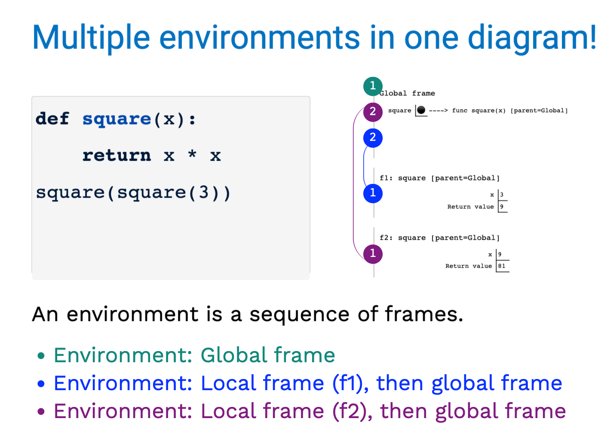
## Review:Higher-order functions
1. a function that takes a function as an argument value
2. a function that returns a function as a return value
`Functions are values in python`
```py
def apply_twice(f, x):
    return f(f(x))

def square(x):
    return x ** 2

apply_twice(square, 3)
```
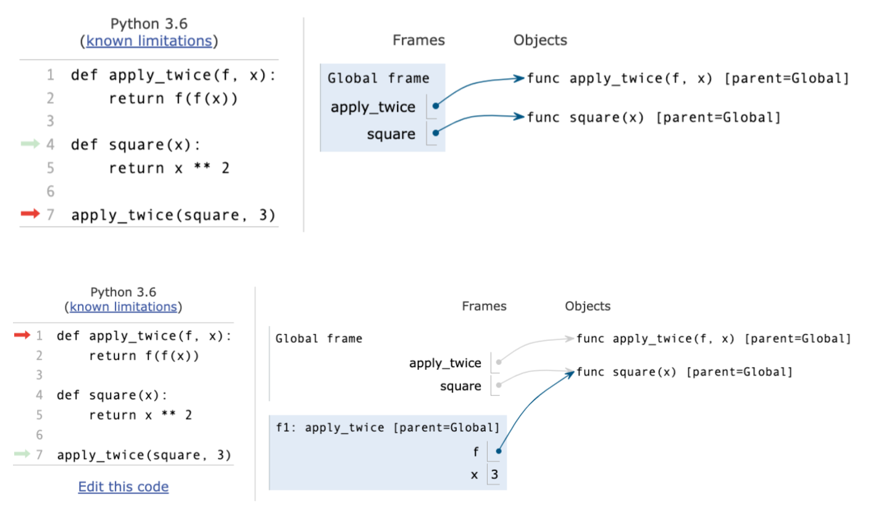
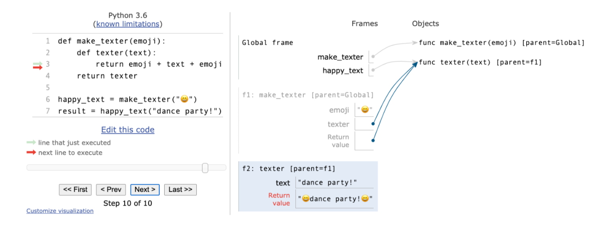
`Every user-defined function has a parent frame`<br>
`The parent of a function is the frame in which it was defined`
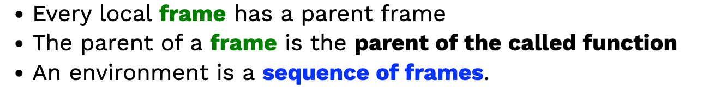
## How to draw an environment diagram
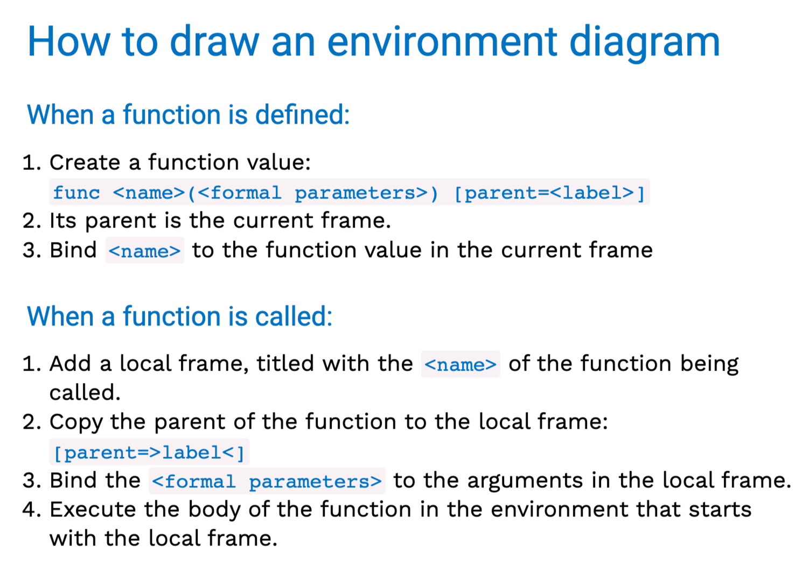
`Local names are not visible to non-nested functions`
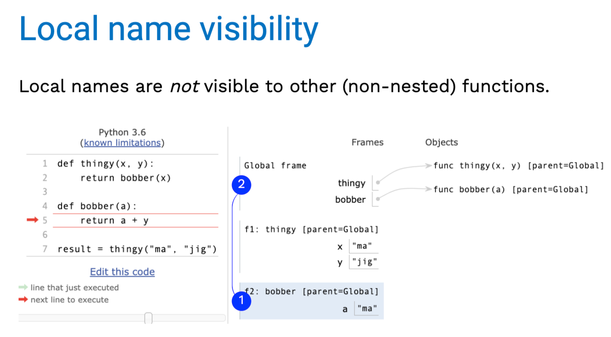
### Composer2 expression tree
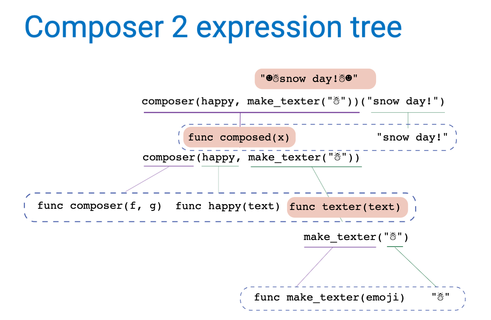
## Function currying
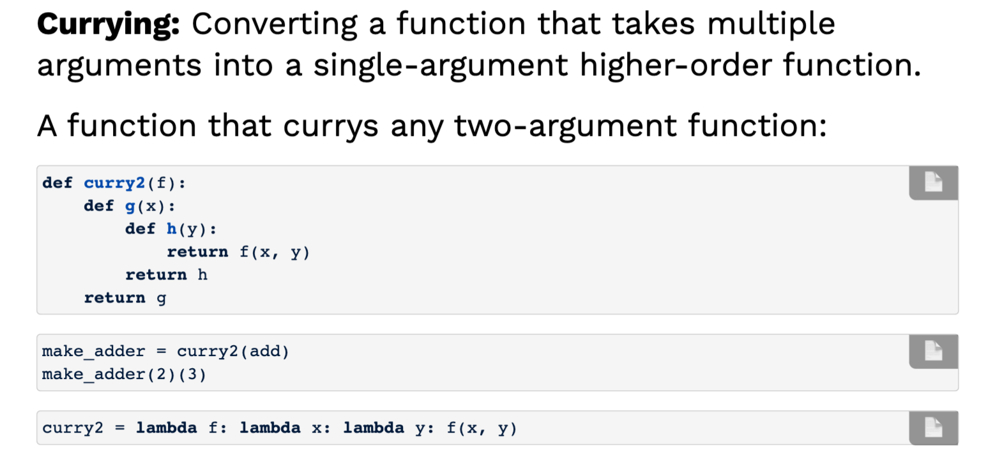