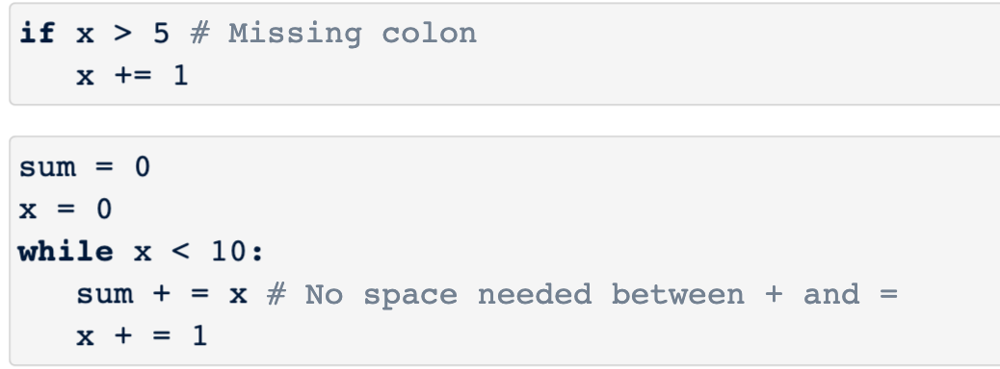
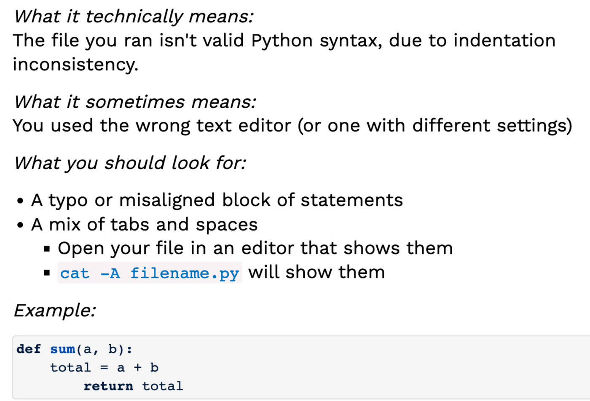
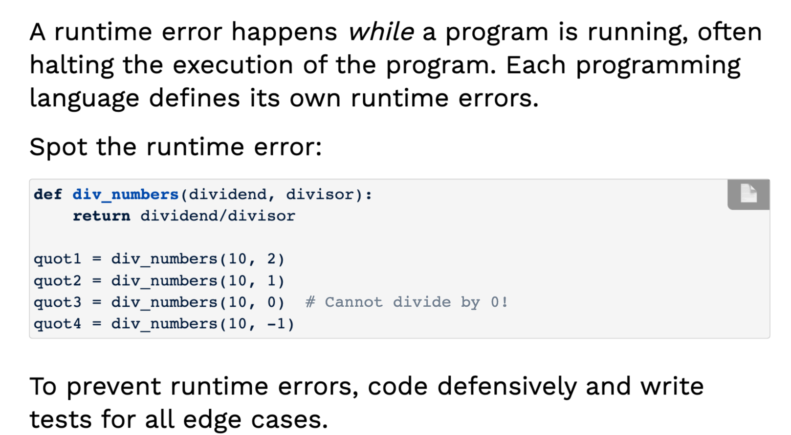
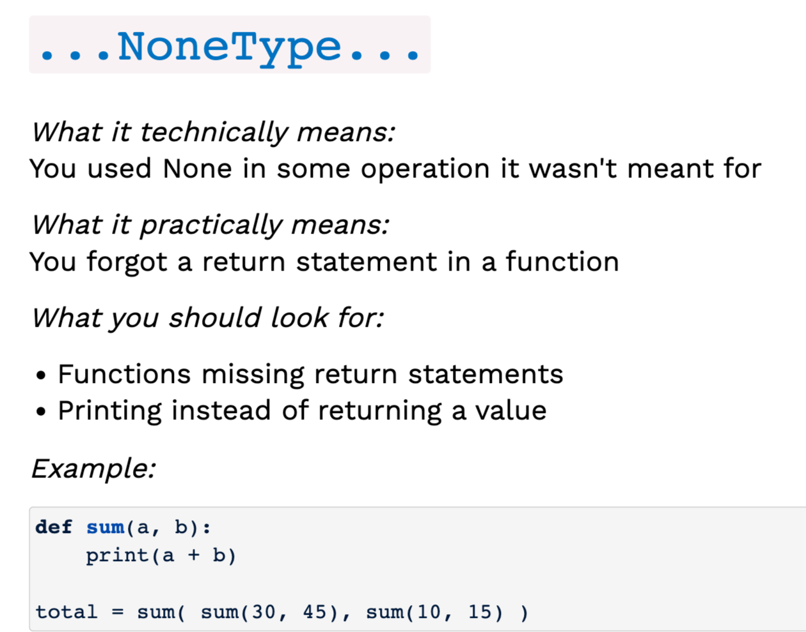
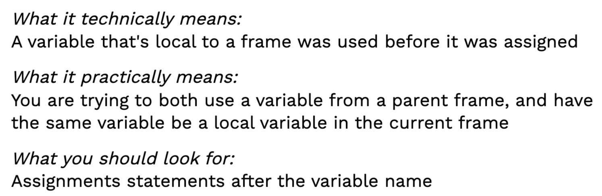
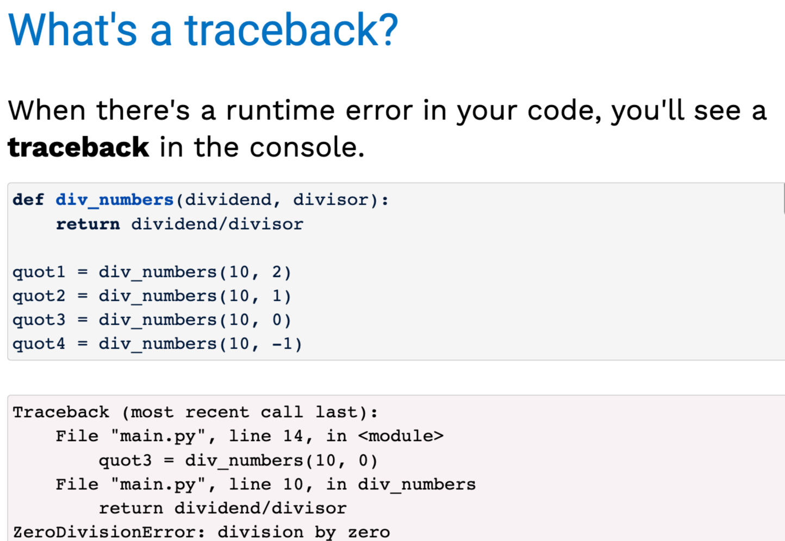
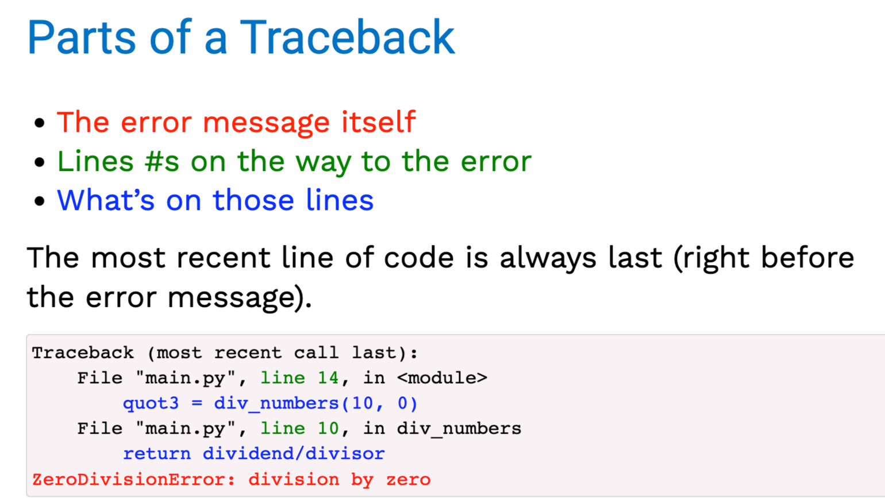
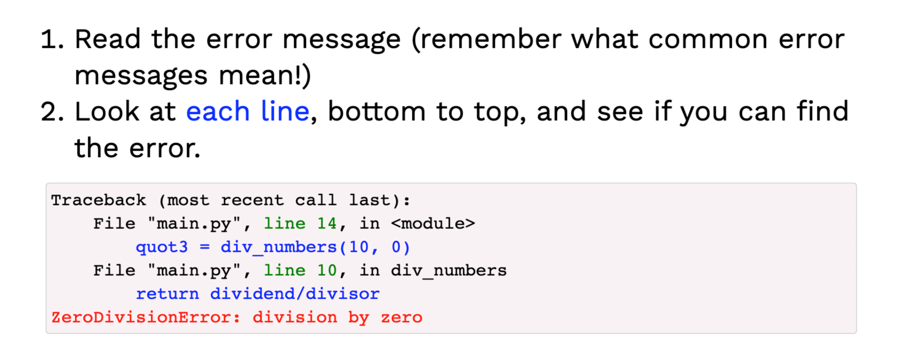

## Types of errors
1. Logic errors
2. Syntax errors
3. Runtime errors
### Logic errors(逻辑错误)
指a program doesn't behave as expected.
### Syntax errors(语法错误)
#### syntaxerror

#### indentationerror/taberror(对齐error)

### Runtime errors

#### NoneType

### UnboundLocalError

```py
sum = 0
def sum_nums(x, y):
    sum += x + y
    return sum
sum_nums(4, 5)
```

### traceback


