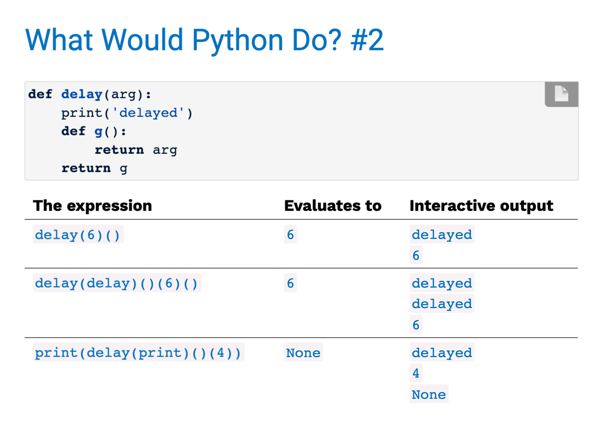
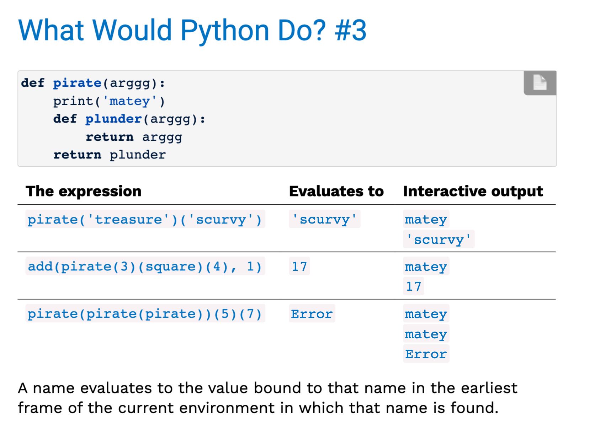

## *Args syntax
the `*args` allows a function to accept any number of arguments.
```py
max(1, 2) # 2
max(10, 30, 20) # 30
max(-2, 33, -40, 400, 321) # 400
```
2. That's possible by using the `*args` syntax in the function definition.
```py
def max(*args):
    #do sth with *args
```
### Forwarding the *args
one way to use `*args` is to send those arguments into another function.
```py
def min_and_max(*args):
    return min(*args), max(*args)
min_and_max(-2, 33, -40, 400, 321) # -40, 400
```
### Forwarding HOF example
`A HOF(Higher-Order-Function)` can return a function that can be called with any number of arguments,and then forward those arguments inside the returned function.
```py
def printed(f):
    def print_and_return(*args):
        result=f(*args)
        print('Result:',result)
        return result
    return print_and_return
printed_max=printed(max)#takes in a max function
printed_max(-2,33,-40,400,321)
```
## Function currying
`Currying`:convert a function that takes multiple arguments into a single-argument higher-order function
```py
def curry2(f):
    def g(x):
        def h(y):
            return f(x,y)
        return h
    return g
#original f(x,y)
#now f(x,y)=f(x)(y)
from operator import add
make_adder=curry2(add)
make_adder(2)(3)
curry2=lambda f:lambda x:lambda y:f(x,y)
```

## Function examples

