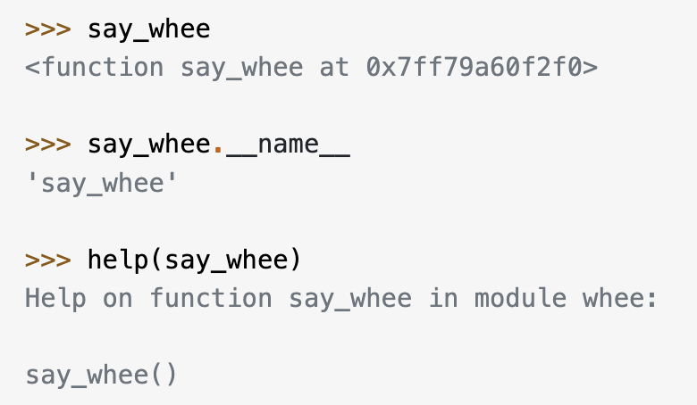

## First-Class Objects
in python,functions are `first-class objects`.This means that functions can be passed around and used as arguments,just like `any other object(string,int,float,list,and so on)`.
```py
def say_hello(name):
    return f"Hello {name}"
def be_awesome(name):
    return f"Yo {name}, together we are the awesomest!"
def greet_bob(greeter_func):
    return greeter_func("Bob")

greet_bob(say_hello)#Hello Bob
greet_bob(be_awesome)#Yo Bob,together we are the awesomest!
```
## Inner Functions
It's possible to `define functions` inside other functions.Such functions are called `inner functions`
```py
def parent():
    print("Printing from the parent() function")
    def first_child():
        print("first_child() function")
    def second_child():
        print("second_child() function")
    second_child()
    first_child()
parent()
##Printing from the parent() function
##first_child() function
##second_child() function
```
`Inner functions are not defined until the parent function is called.`They are locally scoped to parent()
## returnning functions from functions
```py
def parent(num):
    def first_child():
        return "Emma"
    def second_child():
        return "Liam"
    if num==1:
        return first_child#return a reference to the function first_child
    return second_child
first=parent(1)
first()#Emma
```
## Simple Decorators
```py
def my_decorator(func):
    def wrapper():
        print("Something is happening before the function is called.")
        func()
        print("Something is happening after the function is called.")
    return wrapper
def say_whee():
    print("Whee!")
say_whee=my_decorator(say_whee)
say_whee()
# Something is happening before the function is called.
# Whee!
# Something is happening after the function is called.
```
`decorators wrap a function, modifying its behavior.`
### Syntactic Sugar
`use decorators in a simpler way with the @ symbol.`called the `pie syntax`
```py
def my_decorator(func):
    def wrapper():
        print("1")
        func()
        print("2")
    return wrapper
@my_decorator
def say_whee():
    print("Whee!")
```
`@my_decorator is just an easier way of saying say_whee=my_decorator(say_whee)`
### Reusing Decorators
1. Create a file called `decorators.py` with the following content:
```py
def do_twice(func):
    def wrapper_do_twice():
        func()
        func()
    return wrapper_do_twice
```

2. Now,you can use this new decorator in other files by doing a regular import:
```py
from decorators import do_twice
@do_twice
def say_whee():
    print("Whee!")
#Whee!
#Whee!
```

## decorating functions with arguments
`Not only try to decorate the function,but also decorate the function's arguments`

The problem is that the `wrapper_do_twice() doesn't take any arguments` 
We can use`*(asterisk)args and **kwargs` in the inner wrapper function or `function's args`
```py
def do_twice(func):
    def wrapper_do_twice(*args, **kwargs):
        func(*args, **kwargs)
        func(*args, **kwargs)
    return wrapper_do_twice
def do_twice1(func):
    def wrapper_do_twice(name):
        func(name)
        func(name)

    return wrapper_do_twice
from decorators import do_twice, do_twice1, do_twice2

@do_twice
def greet(name):
    print(f"Hello {name}")
@do_twice1
def greet(name):
    print(f"Hello {name}")


greet("曾文杰")
```

## returning values from decorated functions


`that's because the decorator's wrapper function doesn't return the value`
`So,we must make sure the wrapper function returns the return value of the decorated function`
```py
def do_twice(func):
    def wrapper_do_twice(*args, **kwargs):
        t = func(*args, **kwargs)
        # func(*args, **kwargs)
        return t

    return wrapper_do_twice
@do_twice
def return_greeting(name):
    print("Creating greeting")
    return f"Hi {name}"
```

## Who is the function?
If we only use decorator,the function will be confused with decorator's inner function like this:
<br>


decorators should use the `@functools.wraps decorator`,which will preserve information about the original function.
```py
import functools
def do_twice(func):
    @functools.wraps(func)
    def wrapper_do_twice(*args,**kwargs):
        func(*args,**kwargs)
        return func(*args,**kwargs)
    return wrapper_do_twice
```

## The boilerplate template of decorators
```py
import functools
def decorator(func):
    @functools.wraps(func)
    def wrapper_decorator(*args,**kwargs):
        value=func(*args,**kwargs)
        return value
    return wrapper_decorator
```
## Timing Functions
Let's start by creating a`@timer` decorator.It will `measure the time a function takes to execute and print the duration to the console.`
<br>

```py
#decorators.py
import functools
import time
def timer(func):
    """Print the runtime of the decorated function"""

    @functools.wraps(func)
    def wrapper_timer(*args, **kwargs):
        start_time = time.perf_counter()
        value = func(*args, **kwargs)
        end_time = time.perf_counter()
        run_time = end_time - start_time
        print(f"Finish {func.__name__!r} in {run_time:.4f} secs")
        return value

    return wrapper_timer
```
```py
#timer.py
from decorators import timer
@timer
def waste_some_time(num_times):
    for _ in range(num_times):
        sum([i**2 for i in range(10000)])
```

