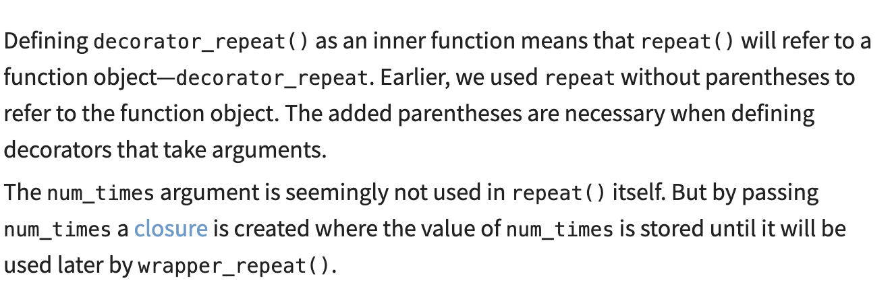

## Decorators on classes
`2 different ways to use decorators on classes`:
### `decorate the methods of a class`

<!-- 1. decorate methods  -->
```py
#decorators.py
import functools,time
def timer(func):
    @functools.wraps(func)
    def wrapper_timer(*args,**kwargs):
        start_time=time.perf_counter()
        t=func(*args,**kwargs)
        end_time = time.perf_counter()
        run_time = end_time - start_time
        print(f"Finish {func.__name__!r} in {run_time:.4f} secs")
        return value
    return wrapper_timer
# TimeWaster.py
from decorators import timer
class TimeWaster:
    def __init__(self, max_num) -> None:
        self.max_num = max_num
    @timer
    def waste_time(self, num_times):
        for _ in range(num_times):
            sum([i**2 for i in range(self.max_num)])
```

### `decorate the whole class`
1. Use the `dataclasses.dataclass`
```py
from dataclasses import dataclass
@dataclass
class PlayingCard:
    rank:str
    suit:str
```

2. Use your decorator
```py
from decorators import timer

@timer
class TimeWaster:
    def __init__(self, max_num):
        self.max_num = max_num

    def waste_time(self, num_times):
        for _ in range(num_times):
            sum([i**2 for i in range(self.max_num)])
```
Decorating a class does not decorate its methods. Recall that `@timer is just shorthand` for `TimeWaster = timer(TimeWaster).`

## Several decorators on one function/Nesting Decorators
`apply several decorators` to a function by stacking them on top of each other
This will call `do_twice`,and then call`timer`,shorthand is `timer(do_twice(greet()))`
```py
from decorators import do_twice, timer
@timer
@do_twice
def greet(name):
    print(f"Hello {name}")
```
If we change the position of `timer` and `do_twice`:<br>
```py
@do_twice
@timer
def greet(name):
    print(f"Hello {name}")
```

## Decorators with arguments
It's useful to `pass arguments to your decorators.`<br>
For instance,`@do_twice` coud be extended to a `@repeat(num_times)` decorator. `The number of times to execute the decorated function could then be given as an argument`
```py
@repeat(num_times=4)
def greet(name):
    print(f"Hello {name}")
```

`to realize repeat(num_times=4)`,we can use follow template:<br>

```py
#decorators.py
def repeat(num_times):
    def decorator_repeat(func):
        def wrapper_repeat(*args, **kwargs):
            for _ in range(num_times):
                value = func(*args, **kwargs)
            return value

        return wrapper_repeat

    return decorator_repeat
### decorators_with_args.py
from decorators import repeat


@repeat(num_times=4)
def greet(name):
    print(f"My name is {name}")
```


## Decorators that can optionally take arguments
`decorators that can be used both with and without arguments`
we should set the function takes optional argument,using special *syntax.
```py
def repeat(_func=None, *, num_times=2):
    def decorator_repeat(func):
        @functools.wraps(func)
        def wrapper_repeat(*args, **kwargs):
            for _ in range(num_times):
                value = func(*args, **kwargs)
            return value
        return wrapper_repeat

    if _func is None:
        return decorator_repeat
    else:
        return decorator_repeat(_func)
```


## Classes as decorators
`using a class as a decorator`
1. take `func` as an argument in its `.__init__`
2. the class instance needs to be `callable` so that it can stand in for the decorated function
```py
import functools
class CountCalls:
    def __init__(self, func) -> None:
        functools.update_wrapper(self, func)
        self.func = func
        self.num_calls = 0
    def __call__(self, *args, **kwds):
        self.num_calls += 1
        print(f"Call {self.num_calls} of {self.func.__name__!r}")
        return self.func(*args, **kwds)
@CountCalls
def say_whee():
    print("Whee!")
```

## Creating Singletons
The only difference is that we are using `cls` instead of func as parameter name to indicate that it is meant to be a class decorator.
```py
import functools

def singleton(cls):
    """Make a class a Singleton class(only one instance)"""
    @functools.wraps(cls)
    def wrapper_singleton(*args, **kwargs):#当调用cls的时候,如果instance=None,说明第一次create,创建,如果不是None,用上一次的instance
        if not wrapper_singleton.instance:
            wrapper_singleton.instance = cls(*args, **kwargs)
        return wrapper_singleton.instance

    wrapper_singleton.instance = None #首先让这个属性=None
    return wrapper_singleton
@singleton
class TheOne:
    pass
```

