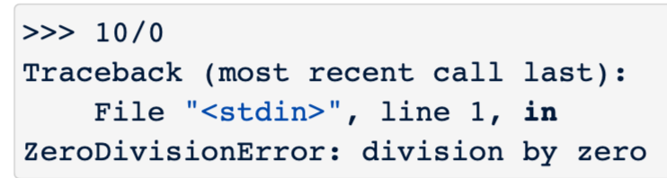
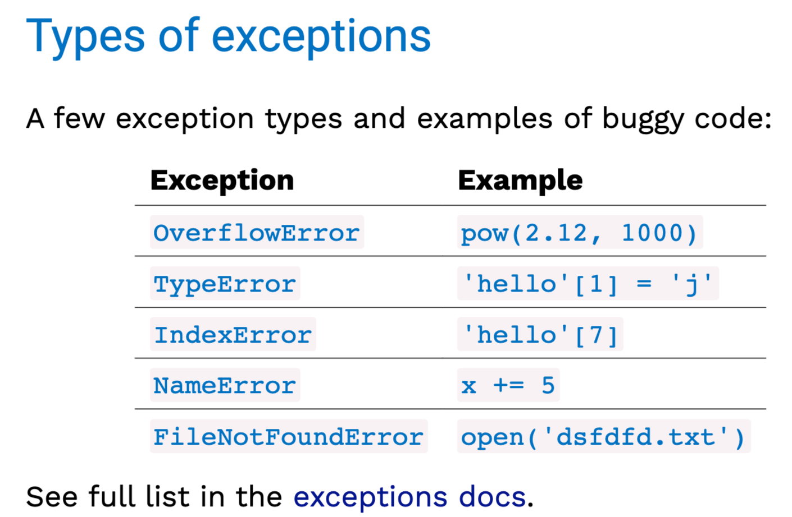
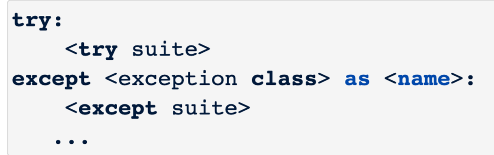
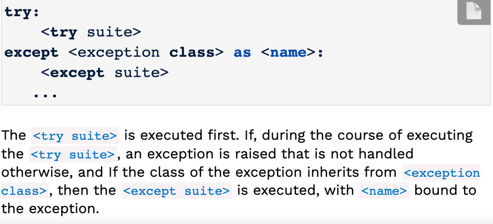
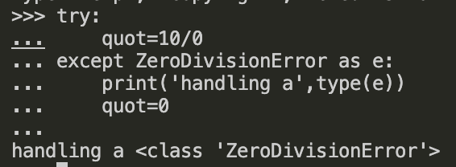
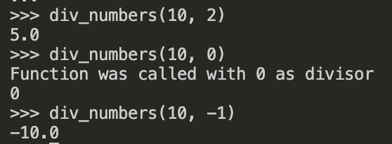
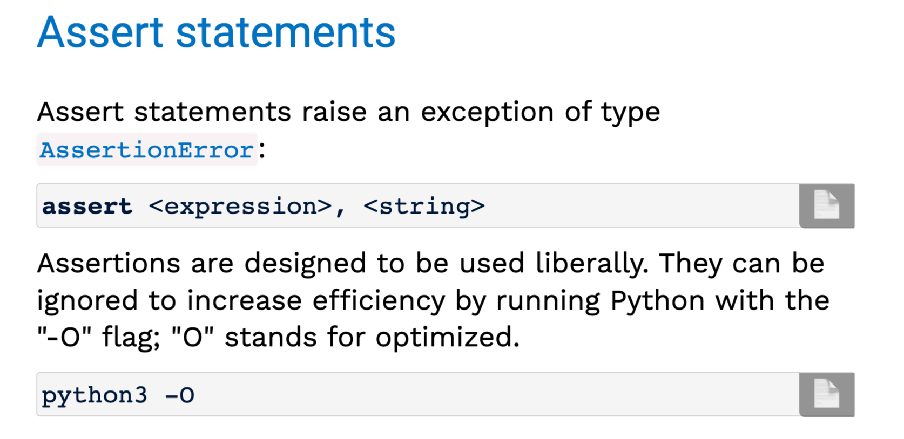
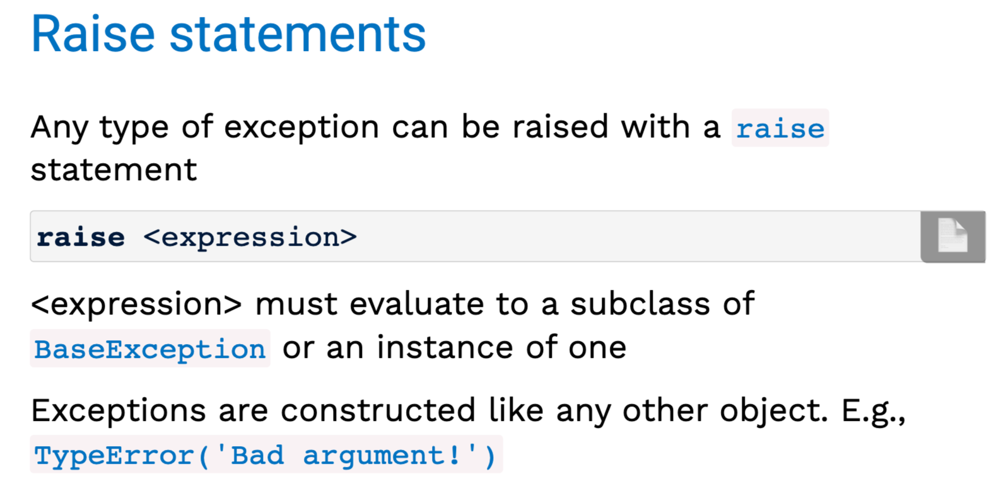

## Exceptions
an `exception` is a built-in mechanism in a programming language to declare and respond to "exceptional" conditions.<br>
a program raises an exception when an error occurs.<br>
If the exception is not handled,the program will stop running entirely.
### Exceptions in Python
`Python raises an exception whenever a runtime error occurs.`
<br>

How an unhandled exception is reported:

If an exception is not handled,the program stops executing immediately.
### Types of exceptions

## The try statement
To handle an exception(keep the program running),use a `try` statement.<br>


```py
try:
    quot=10/0
except ZeroDivisionError as e:
    print('handling a',type(e))
    quot=0
```

```py
def div_numbers(dividend, divisor):
    try:
        quotient = dividend/divisor
    except ZeroDivisionError:
        print("Function was called with 0 as divisor")
        quotient = 0
    return quotient

div_numbers(10, 2)
div_numbers(10, 0)
div_numbers(10, -1)
```

## Raising exceptions

