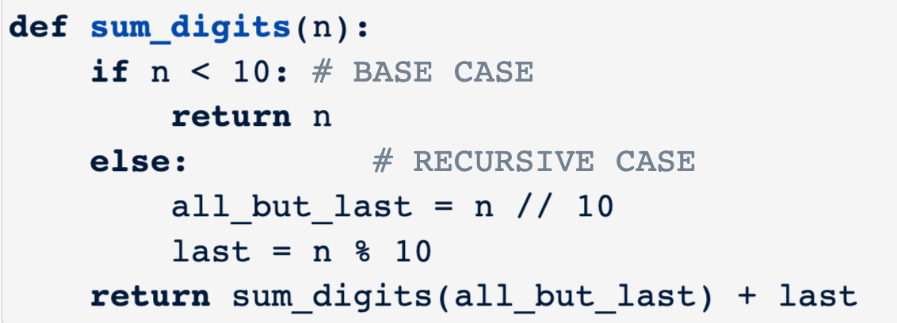

## Recursive functions
a function is `recursive` if the body of that function calls itself,either directly or indirectly.
```py
def sum_digits(n):
    """
    >>> sum_digits(6)
    6
    >>> sum_digits(2021)
    5
    """
    if n < 10:
        return n
    else:
        all_but_last = n // 10
        last = n % 10
        return sum_digits(all_but_last) + last


print(sum_digits(2021))#5
```
## Anatomy of a recursive function
1. Base case: evaluated `without a recursive call(the smallest subproblem)`
2. Recursive case:(breaking down the problem further)
3. Conditional statement:to decide if it's a base case 


